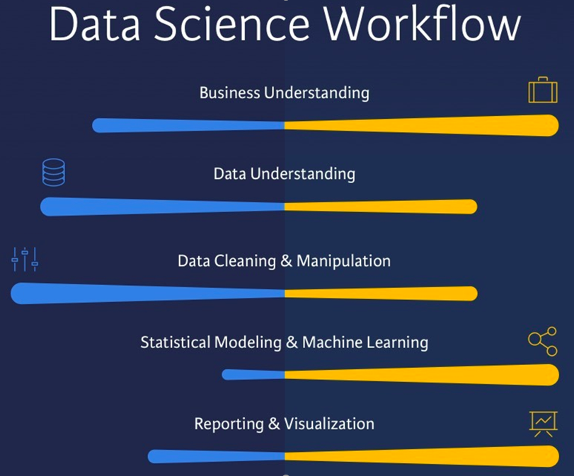
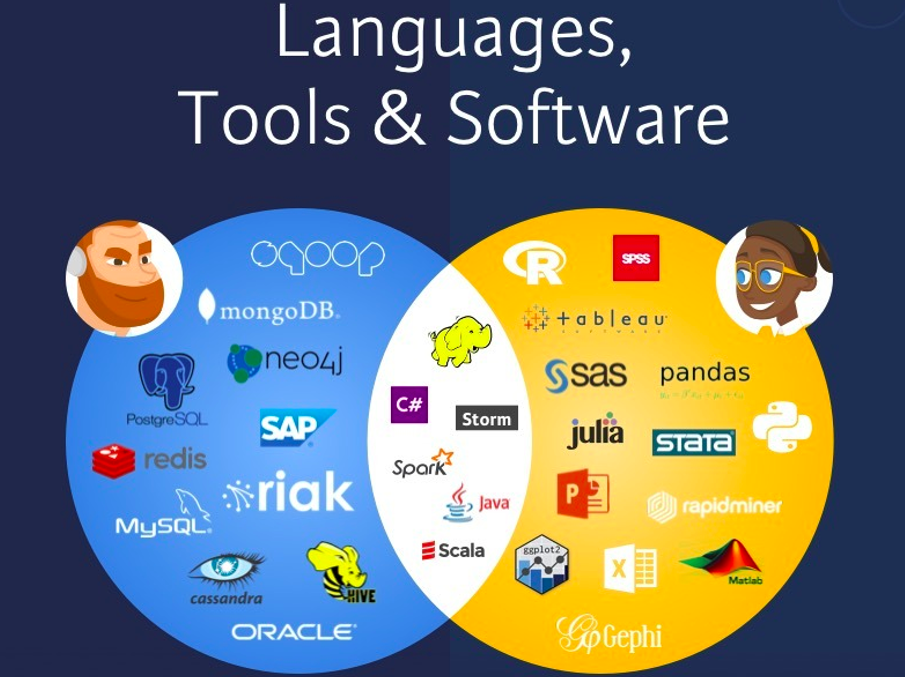

# Data Engineering con R

El proceso de Data Science se puede dividir, como ya hablamos en la intruducción en:

1. Data Engineering (para estructurar los datos).

* Desarrollar, construir, probar y mantener arquitecturas (como bases de datos y sistemas de procesamiento a gran escala).
* Implementar una arquitectura útil para los casos de negocios
* Desarrollo de oportunidades para la adquisición de datos.
* Establecer procesos de conjuntos de datos para modelización, minería y producción.
* Emplear una variedad de lenguajes y herramientas para conectar sistemas.
* Recomendar maneras de mejorar la fiabilidad, eficiencia y calidad de los datos.

2. Data Scientist (para modelizar los datos). 

* Limpia, organiza y estructura datos. Desarrolla modelos de ML, probabilísticos, realiza análisis y estadísticas descriptivas para desarrollar perspectivas, y resuelve necesidades empresariales.
* Llevar a cabo desarrollos para responder a preguntas de la industria y los negocios.
* Aprovechar grandes volúmenes de datos de fuentes internas y externas para responder a ese negocio.
* Implementar softwares de análisis, aprendizaje automático y métodos estadísticos para preparar los datos para su uso en modelos predictivos y explicativos.
* Explorar y examinar los datos para encontrar patrones.

3. Data Analysis (para visualizar datos). 

* Los Data Analysts desempeñan un papel importante al solicitar información de una base de datos o realizar consultas.
* Pueden procesar y aprovechar los conjuntos de datos para proporcionar informes resumidos y visuales.
* La función principal de un analista de datos es inferir datos sin procesar para explorar patrones y sacar conclusiones.
* Utilizan procesos metodológicos y aplican algoritmos para llegar a estas conclusiones.
* Si bien un analista de datos puede usar algoritmos para respaldar su función, no se espera que los desarrollen ni suelen tener una sólida formación matemática o de investigación, su función requiere una comprensión básica de estadística, recopilación de datos y muy fuerte en visualización y análisis de datos exploratorios.
* Los analistas de datos ayudan a simplificar los datos complejos a informes y cuadros ad hoc, lo que permite a las empresas explotar al máximo sus datos. 

Data Engineering vs Data Scientist:

Data Scientist vs Data Analyst:

